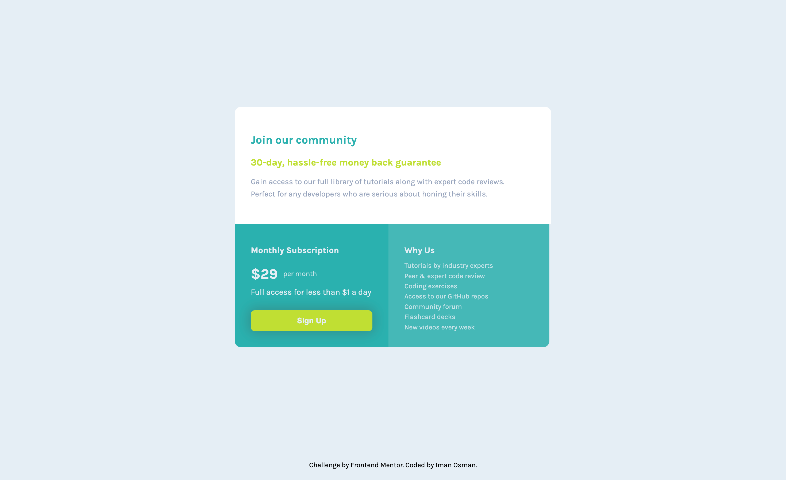

# Frontend Mentor - Single price grid component

## Table of contents

- [Overview](#overview)
- [Goal](#goal)
- [Outcome](#outcome)
- [My process](#my-process)
- [Built with](#built-with)
- [Feedback](#feedback)
- [Lessons](#lessons)
- [Take forward](#take-forward)
- [Useful resources](#useful-resources)

## Overview

This challenge requires that I use CSS Grid to achieve a responsive single price component design. I'm going to approach it Desktop-first, see if I can achieve it with Flex first, and then design for mobile.

## Goal

Here, I'm going to try and finish this one quickly, as it looks simple enough. The past few projects have been more challenging so I'd like to see how fast I can comfortably complete this.

## Outcome

:jigsaw: [Live Site URL](https://i000o.github.io/single-price-grid/)  
:pencil2: [Solution URL](https://www.frontendmentor.io/solutions/single-price-grid-component-7df4FFt8Vn)

## Built with

:gear: Semantic HTML5 markup  
:gear: CSS Grid  
:gear: Desktop-first workflow  
:gear: Sass

## My process

:alien: After mapping out my HTML, I started styling.  
:alien: I imported my usual Sass partials and the font. I initially tried to approach this with Flex, using the `stretch` value and `align-self` property, but I couldn't enforce the rows to be exactly the same width, even before making the design responsive, so I understood that I needed to use Grid, as the title suggests.  
:alien: Upon doing this, it was much easier and I could get into the responsive design sooner, as well as mobile.  
:alien: I finished the task probably one of the fastest than ever before. I feel much more confident with my styling now, and know how to target what I want and quickly resolve unexpected behaviours.  
:alien: One of the last things I tried to style was the `box-shadow`. I found that I was unable to target the card element directly to apply this. I tried changing the target to a class name, but this broke my design. I was disappointed in this, because I knew it was a simple thing to apply as I'd done it before, but that I might've made an error in the more foundations aspects of the site for it to break so easily.  
:alien: I asked for support on this from other developers and received some enlightening feedback.

## Time taken

:alarm_clock: Mobile: 30 mins  
:alarm_clock: Desktop: 2.5 hrs

## Feedback

I got some great feedback from another developer about specificity and the impact of nesting. They note that the reason I couldn't achieve a change in `border-radius` for mobile was due to the specificity I had used. They recommended targeting classes rather than HTML elements so that I didn't have long lists of multiple selectors and could instead, individually target declarations. I knew I wasn't using the concept of classes in CSS to their full potential or purpose, but I wasn't sure how. I understand this better now and want to implement this practice into a habit in future.  
I wasn't aware either of the impact of nesting in the CSS. I overlooked it in the instance, thinking that more nesting meant more organised code, but actually I was digging my declarations into deeper hole, in a way making them unnecessarily less accessible to the browser. I want to keep this in mind as it is tempting to be able to collapse code down when I work, but I need to be mindful of the way it translates to my `output.css` file (which I probably don't look over enough).

## Lessons

1. The importance of getting into the habit of using classes over element targeting in CSS. As my sites grow in content, targeting elements will create global changes, while classes are more specific. This also cleans up the CSS substantially, and avoids long lists of multiple target selectors.
2. CSS Grid is for both vertical and horizontal aligning simultaneously - Don't be tempted to use Flex, it'll be a waste of time.
3. I need to learn more about specificity and the cascade! I have an article to read on this.
4. I can be super speedy with some designs.

## Take forward

:grey_exclamation: I'm speedy at these layouts now.  
:grey_exclamation: Specificity and nesting - the impact on my CSS.  
:grey_exclamation: Targeting classes not elements.  
:grey_exclamation: Grid is so nice.

## Useful resources

[A primer on the cascade and specificity](https://piccalil.li/blog/a-primer-on-the-cascade-and-specificity/)

# single-price-grid
